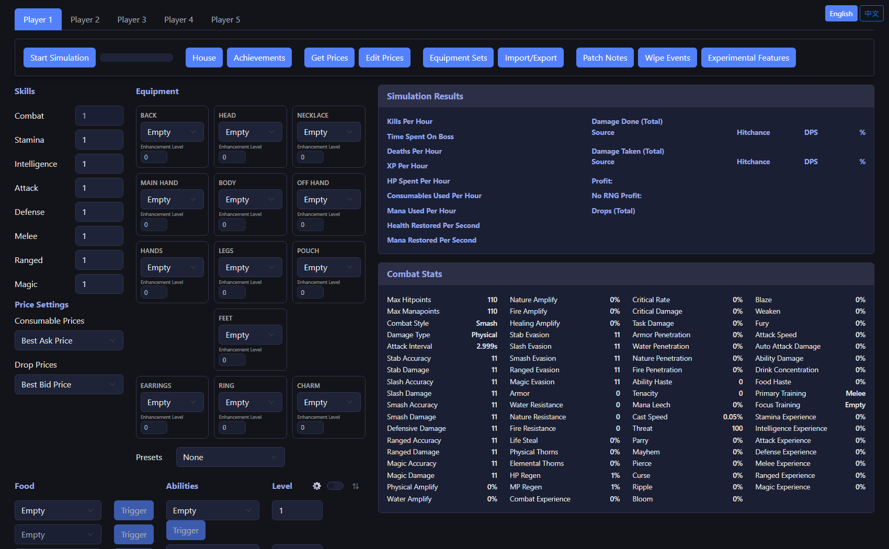

# Milky Way Idle Combat Simulator

A free, browser-based **combat simulator, DPS calculator, and build planner** for [Milky Way Idle](https://www.milkywayidle.com/), the multiplayer idle RPG. Plan your equipment, abilities, and combat triggers, then simulate hours of combat instantly to compare loadouts, estimate profit per hour, and optimize your build — all without touching the actual game.

**[Try it live →](https://mwi-combat-simulator-better.vercel.app/)**



## Features

- **Full equipment planner** — every gear slot (weapon, off-hand, armor, jewelry, pouch) laid out in a grid, with enhancement levels and searchable item selection.
- **Skills, food, drinks, and abilities** — configure levels, consumables, and up to 5 ability slots with per-slot combat triggers.
- **Combat triggers** — fine-grained conditions for when abilities and consumables should fire automatically during a fight.
- **Combat stats breakdown** — accuracy, damage, evasion, resistances, amplify, penetration, regen, and every other derived stat for your current build.
- **Simulation results** — kills/hour, XP/hour, deaths/hour, HP/MP usage, consumable usage, and a full damage-done/damage-taken breakdown by source.
- **Profit calculator** — pull live marketplace prices and see estimated profit per hour, with and without RNG drops.
- **Group combat** — build and simulate up to 5 players at once for party/dungeon content.
- **Dungeons & Labyrinth** — simulate dungeon runs and labyrinth crate outcomes.
- **Sim All Zones** — batch-simulate every combat zone at once to find the most efficient or profitable one for your build.
- **Equipment sets** — save and reload named gear presets.
- **Import/Export** — share a build as JSON, solo or as a full 5-player group.
- **Autosave** — your current build is saved automatically in your browser and restored next time you visit, so there's no need to manually export/import between sessions.
- **Dark, game-matching theme** — styled after Milky Way Idle's own navy-and-periwinkle look.

## Live demo

**https://mwi-combat-simulator-better.vercel.app/**

## Development

### Prerequisites

- [Node.js](https://nodejs.org/) and npm

### Install dependencies

```bash
npm install
```

### Build

```bash
npm run build
```

Builds the webpack bundle into `dist/`.

### Run locally

```bash
npm start
```

Starts a dev server at [http://localhost:9000](http://localhost:9000) and opens it in your browser.

## Credits

This project is a fork of a fork, built on the work of many prior contributors, including KuganDev, Vlad (mwisim), and AmVoidGuy.

## Disclaimer

This is an unofficial, fan-made tool and is not affiliated with or endorsed by the developers of Milky Way Idle.

## License

[MIT](LICENSE)
